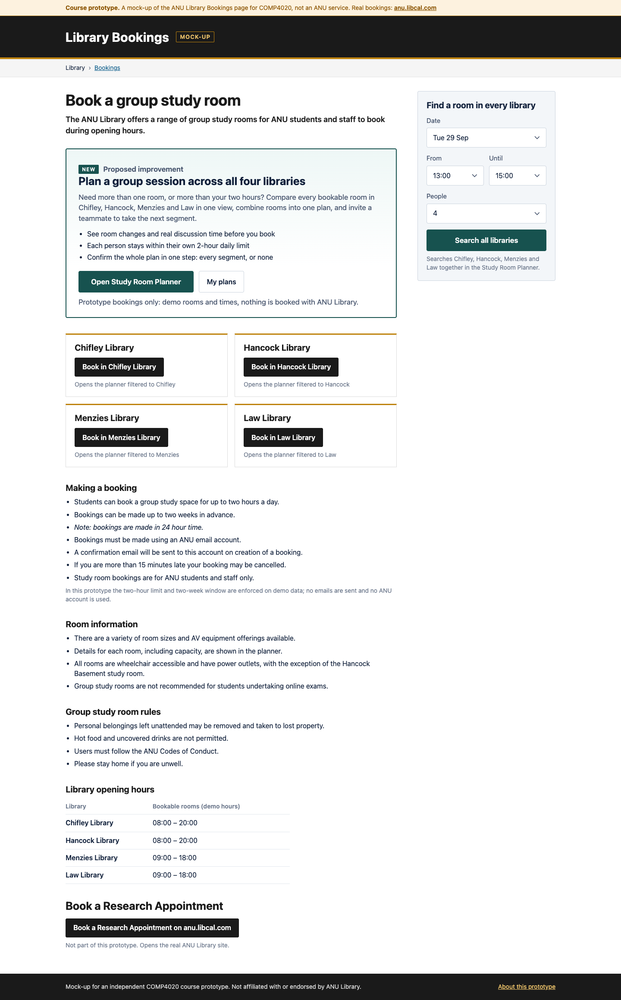

# Process overview

## What I built

Study Room Planner, live at <https://comp4020-crit7-aurorasundev.fly.dev>. It
shows study rooms across Chifley, Hancock, Menzies and Law in one view,
builds multi-segment plans, finds teammates by student number, and confirms
all-or-nothing. It is reached from a labelled mock-up of the ANU bookings
page. `README.md` says what good means here.

## How I got here

I wrote the spec first (`plan.md` plus four reference images) and asked the
agent to audit it before building
([`8c57b9f`](https://github.com/comp4020-agentic-coding-studio/comp4020-crit7-aurorasundev/commit/8c57b9f)):

> 仔细阅读和分析crit7项目的plan后，分析其中细节是否合理，然后规划出网站的搭建流程，然后开始搭建网站

Working from the brief, `fly.toml` and the CI workflow, it found that my two
demo scenarios contradicted each other and that deleting the starter's SSE
endpoint would break the CI deploy check. I chose a demo reset and two demo
users. Those decisions became `CLAUDE.md` rules and a spec run against the
built server
([`65539a0...0a1286f`](https://github.com/comp4020-agentic-coding-studio/comp4020-crit7-aurorasundev/compare/65539a0...0a1286f)).

Three corrections shaped the result. The first screenshots ignored my
references, so I made them the visual authority
([`f81f6d3`](https://github.com/comp4020-agentic-coding-studio/comp4020-crit7-aurorasundev/commit/f81f6d3)):

> 补充：网站网页的视觉效果以 reference images文件夹中的参考图为准

On the live site, Accept was recorded as Decline. The double-submit guard
dropped the clicked button's value, and the HTTP spec never runs page
scripts, so it missed this
([`f2ad769`](https://github.com/comp4020-agentic-coding-studio/comp4020-crit7-aurorasundev/commit/f2ad769)).
After the home page landed
([`c7a55f6`](https://github.com/comp4020-agentic-coding-studio/comp4020-crit7-aurorasundev/commit/c7a55f6)),
Search rooms still pointed at it. I asked for that fix along with a more
realistic invitation flow and cancellation
([`436d54d`](https://github.com/comp4020-agentic-coding-studio/comp4020-crit7-aurorasundev/commit/436d54d)):

> 在invite a teammate这个功能中，实现得更现实一些，先输入队友学号进行搜索

I also had the searched period's start and end marked in red on the grid
([`c2244f2`](https://github.com/comp4020-agentic-coding-studio/comp4020-crit7-aurorasundev/commit/c2244f2)).
And because switching student had left you on the same page, I made it land
on the home page like a real sign-in
([`8c0a165`](https://github.com/comp4020-agentic-coding-studio/comp4020-crit7-aurorasundev/commit/8c0a165)).

I knew it was right because `pnpm check` stayed green at every commit. After
each deploy I reran the CI's live checks and clicked the core flow in a real
browser.

