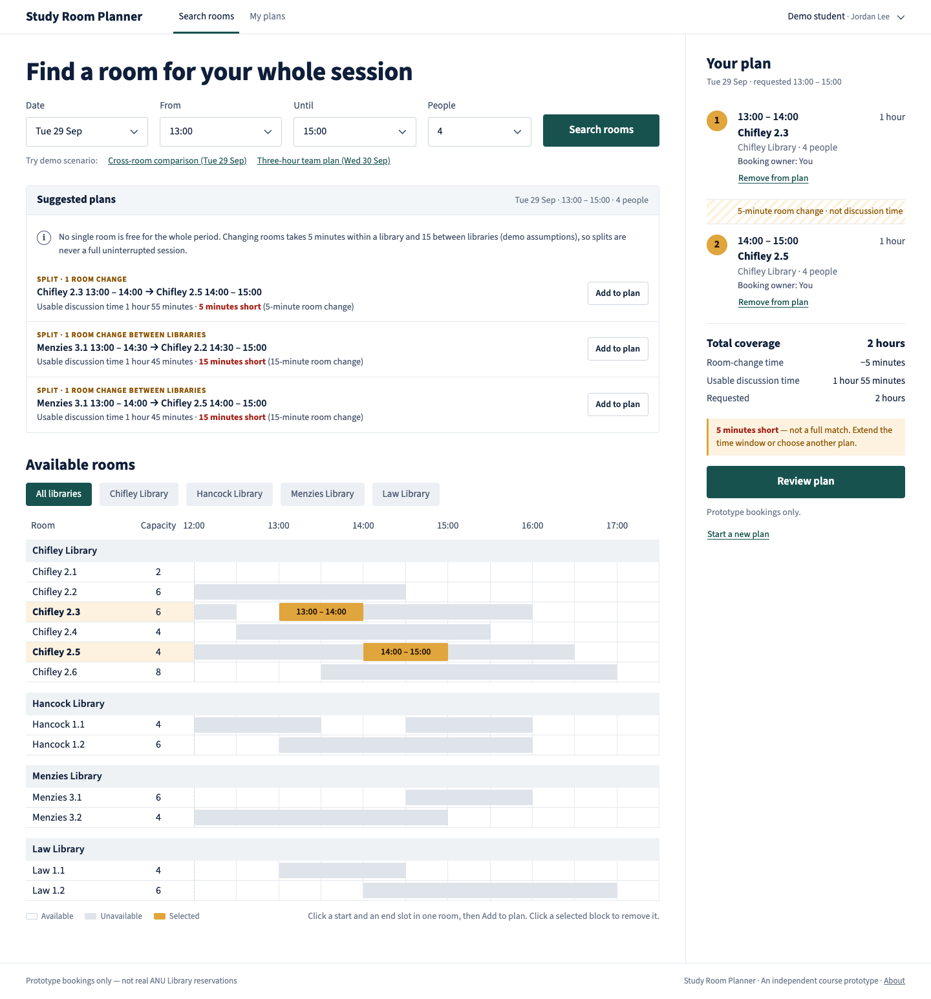
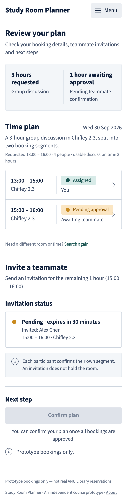

# Process overview

## What I built

Study Room Planner: a prototype for one slice of ANU Library room booking.
It compares rooms across Chifley, Hancock, Menzies and Law in one view,
builds a multi-segment plan, lets a teammate accept responsibility for a
segment through an in-app invitation, and confirms the plan server-side in
one all-or-nothing transaction. It is live at
<https://comp4020-crit7-aurorasundev.fly.dev>. `README.md` says what the app
is and what "good" means for it.

## How I got here

**Planning before building.** I wrote the product spec myself in `plan.md`,
with four generated reference images, and committed both alongside the first
harness rules in [`8c57b9f`](https://github.com/comp4020-agentic-coding-studio/comp4020-crit7-aurorasundev/commit/8c57b9f).
I asked the agent to check the plan before touching code:

> 仔细阅读和分析crit7项目的plan后，分析其中细节是否合理，然后规划出网站的搭建流程，然后开始搭建网站

The agent read the course brief, `fly.toml`, the Dockerfile, the CI workflow
and `spec/`, then came back with a plan that found real problems in mine:

- Scenario 1 needs Chifley 2.3 free only 13:00–14:00, but scenario 2 needs
  the same room free 13:00–16:00 on the same day. We moved scenario 2 to the
  following day.
- The CI deploy job probes `/api/events` and form POSTs to `/`, so deleting
  the starter's SSE endpoint would break every deploy. We kept it and reused
  it for plan-change notices.
- A three-hour single-room match still needs a second booking owner. The
  organiser now owns only what is left of their allowance; the rest becomes
  "needs a teammate".

It also asked me two questions that were my call. I chose a **Reset demo
data** button, because repeated demos use up the 2-hour allowance, and I
chose to keep only two demo users (so Alex Chen plays the conflict case)
rather than adding a third.

**Grounding the rules.** I turned my decisions into `CLAUDE.md` rules:
`plan.md` is authoritative for behaviour; the server enforces capacity,
overlap, the daily limit and expiry; schema changes go through
`pnpm db:generate`; ask before deploying. The app, with unit tests for the
pure planner rules, landed in
[`65539a0`](https://github.com/comp4020-agentic-coding-studio/comp4020-crit7-aurorasundev/commit/65539a0),
and the HTTP spec in
[`0a1286f`](https://github.com/comp4020-agentic-coding-studio/comp4020-crit7-aurorasundev/commit/0a1286f).
The spec runs against the built server and checks reload persistence, the
daily limit, invitation accept/decline/expiry, a conflict that writes no
partial bookings, and the invariants on dynamic routes.

**Corrections along the way.**

- *Visual direction.* The first screenshots were a generic interpretation of
  the references: hatched cells, rounded pills, a lede paragraph. Mid-build
  I corrected it:

  > 补充：网站网页的视觉效果以 reference images文件夹中的参考图为准

  That became a harness rule in
  [`f81f6d3`](https://github.com/comp4020-agentic-coding-studio/comp4020-crit7-aurorasundev/commit/f81f6d3)
  (which also accidentally carried the guestbook deletions I had staged
  earlier; I left the history as it is rather than rewrite it), and the agent rebuilt the grid, rail, chips and mobile records against the
  images. It compared scripted screenshots at 1440px and 390px with the
  references, which led to the follow-up fixes in
  [`48df1eb`](https://github.com/comp4020-agentic-coding-studio/comp4020-crit7-aurorasundev/commit/48df1eb)
  (the date shown as "Tue 29 Sep", chevron selects, mobile type sizes).
- *A real bug found by the screenshot script.* Page loads started hanging
  after a few navigations. The cause was open SSE connections from pages
  held in the back/forward cache, which used up the browser's six
  connections per host. The fix closes the stream on `pagehide`.
- *A bug found by the spec.* The "latest invitation" was picked by
  timestamp, so an aged invitation hid a newer one. It now uses insertion
  order.
- *A bug I found on the deployed site.* As Alex Chen, clicking **Accept
  segment** showed "Invitation declined". I reported it:

  > 目前部署的网站出现了一个按钮问题，当我切换到Alex Chen的界面点击accept segment后，弹出的提示是invitation declined

  Two defects combined. The double-submit guard disabled buttons inside the
  `submit` handler, and a disabled submitter is dropped from the form data,
  so `decision=accept` never reached the server. The endpoint then treated
  a missing decision as a decline. A scripted real-browser click reproduced
  it on the live site. The HTTP spec had missed it because it posts forms
  directly and never runs the page script. The fix in
  [`f2ad769`](https://github.com/comp4020-agentic-coding-studio/comp4020-crit7-aurorasundev/commit/f2ad769)
  requires an explicit accept or decline, and the guard now blocks
  resubmission with a flag. A regression test covers the endpoint, and every
  main button was re-clicked in a real browser.
- *Tooling.* `drizzle-kit generate` needs an interactive answer when a table
  is dropped and others created at once. We split it into two migrations
  (create, then drop) instead of hand-editing SQL.

**How I knew it was right.** `pnpm check` (typecheck, build, 58 tests) stayed
green before every commit. After deploying I ran the CI's post-deploy checks
by hand (200, SSE bytes, same-origin POST accepted, cross-site POST refused,
no broken internal links). I then ran the three-hour team story on the live
site: compose, invite, accept as Alex Chen, confirm, reload. Both
reservations persisted, and I reset the demo data afterwards.

